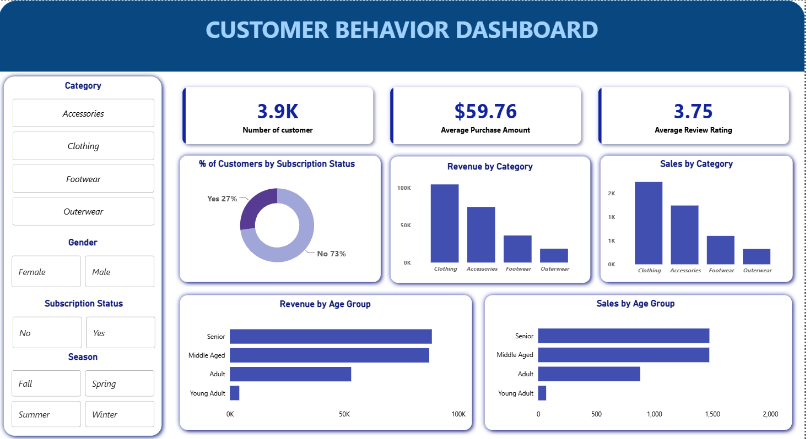

<h2>👨🏻‍💻 Customer Behavior Data Analysis</h2>

An end-to-end Data Analytics portfolio project built as a student project to analyze customer shopping behavior and turn raw customer data into meaningful business insights.

This project follows a practical industry-style workflow using Python, SQL, and Power BI — from data cleaning and exploratory analysis to SQL-based business analysis and interactive dashboard development.

<h3>📌  Project Overview</h3>

The goal of this project is to simulate a corporate-grade end-to-end data analytics workflow, demonstrating the ability to translate raw data into strategic business intelligence by:

✅ Data Preparation,Modeling & Exploratory Data Analysis (Python): Clean and transform the raw dataset for analysis.

✅ Data Analysis (SQL): Simulate business transactions, and run queries to extract insights on customer segments, loyalty, and purchase drivers.

✅ Visualization & Insights (Power BI): Build an interactive dashboard that highlights key patterns and trends, enabling stakeholders to make data-driven decisions.

✅ Presentation:  Prepare a presentation that visually communicates insights and actionable recommendations to stakeholders.

<h3>🛠️ How to Use This Project</h3>

1. **Clone the repository**
   ```bash
   git clone https://github.com/Customer-Behavior-Analysis.git
   ```
2. **Open Customer_behavior.ipynb notebook**

    This file contains:

      - Data Import

      - Data exploration

      - Data cleaning

      - Connection to SQL Database
  
3. **Load the data from Python notebook into MySQL/PostgreSQL/MS SQL Server**

      - Create a database in SQL

      - Run Python code to load data into SQL database
  
      - Open **customer'.sql**
  
      - Answer Business Questions using SQL Queries 
      
4. **Connect the SQL Database to Power BI**

      - Open **customer_behavior_dashboard.pbix**
   
      - Create interactive dashboard in Power BI
  
6. **Create Project Presentation**

    - Build presentation deck using Gamma AI
<h2>Dashboard</h2>
<p align="center"></p>

## 💡 Thanks for checking out the project! Your support means a lot! Feel free to star ⭐ this repo.
